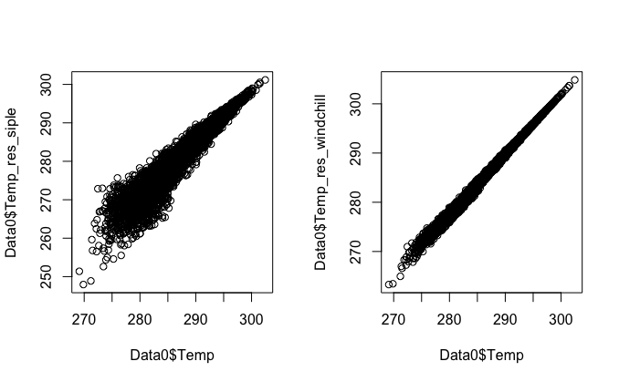
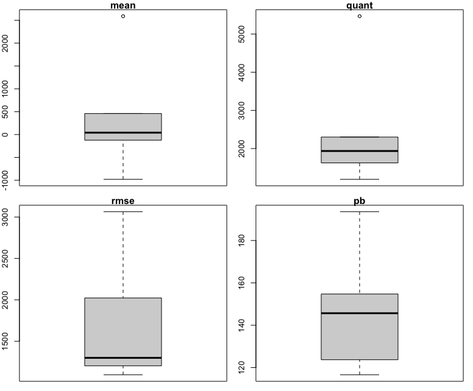
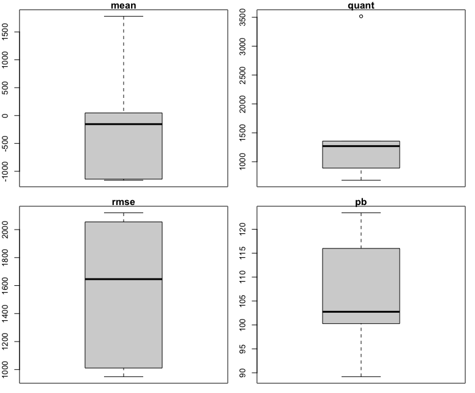
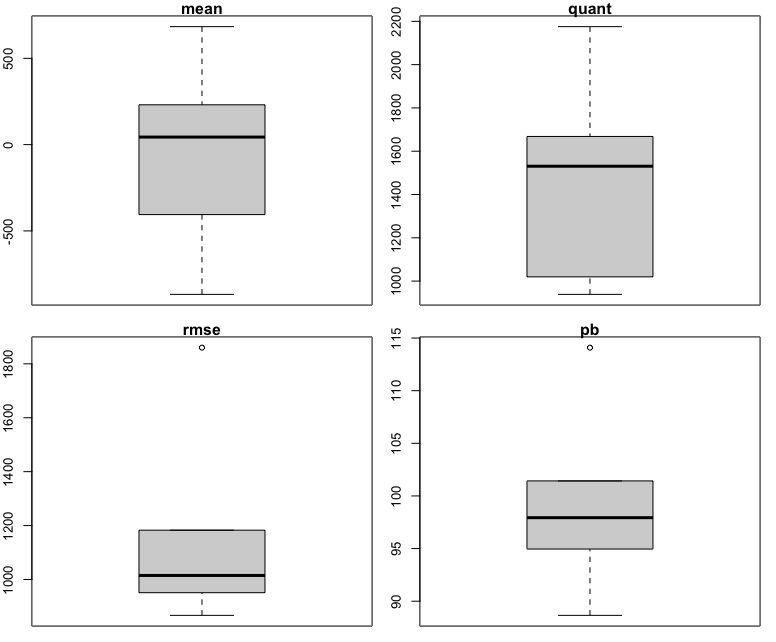
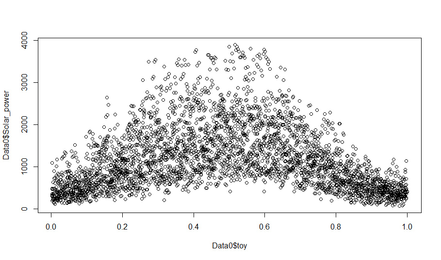
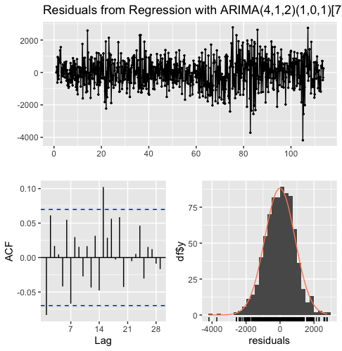

```{r setup, include=FALSE}
knitr::opts_chunk$set(echo = TRUE)
```

## Introduction

Electric Load Forecasting is the process of predicting the future electricity demand within a specific geographical area over a certain period of time, typically ranging from hours to years. This forecasting involves analyzing historical electricity consumption data, considering various influencing factors such as weather patterns, economic indicators, population growth, and technological advancements, to project future electricity usage accurately.

In this project, we tested different models and techniques for day-ahead ex-post forecasting of total net demand in France during France's sobriety period following winter 2022. The challenge of this project stemmed from the constraint of having access to data only up to August 2022 to train our models. No historical data could replicate the special circumstances of France's energy sobriety plan following September 2020, so we needed to apply non-stationary processes forecasting techniques, such as ARIMA.

## Preliminaries

This project was developed as part of a private Kaggle competition. One of the complexities of the competition lay in the choice of the evaluation metric by the organizer; the objective was to achieve the best score on a private dataset with respect to the pinball loss for quantile 0.95, described below.

$$
l_{\alpha}(y-q) = \alpha |y-q|^{+} (1-\alpha )|y-q|^{-}\quad \text{where} \quad |x|^{+} = max(x,0),\quad |x|^{-} = max(-x,0)
$$

It is easily shown that the solution $q^{*}$ of $$ 
argmin_q(\mathbb{E}[l_{\alpha}(y-q)])
$$ verifies $$
F(q*) = \alpha 
$$

Where $F$ is the cdf. So in order to minimize the loss we need to effectively estimate the 0.95 quantile of the test dataset.

## Summary

After performing some basic but necessary transformations to our dataset, we began by focusing our efforts on testing different models, collecting additional data and performing some other, more advanced transformations to our dataset. Our first breakthrough in performance came when we started testing GAM models. From that point on, we mainly finetuned this model. To do this, we focused on finding the most significant covariate effects, on adding carefully chosen quantiles to the fit model, and on further improving the model by applying ARIMA correction.

One recurrent idea through our development process consisted on performing sliding window cross-validation to train our models.

## Data Gathering

The COVID period introduced once again a non stationary effect we had to account for. We gathered data regarding the evolution of the crisis in France from the following repository [Oxford Covid-19 Government Response Tracker (OxCGRT)](https://github.com/OxCGRT/covid-policy-dataset?tab=readme-ov-file). Specifically we collected data from the `OxCGRT_simplified_v1.csv` file. We performed some filtering on the file and we then added our new covariables to our dataset.

## Feature Engineering

We started by performing some basic but fundamental variable transformations: we coded into factor the `WeekDays` variable, and we also created a new numerical variable, `Time` that encodes `Date` into a numerical format.

A more advanced transformation that we carried out consisted of adjusting the nebulosity variable. We can observe that there is a clear regime shift between 2016 and 2017. This is because before 2017, it was human operators who were scoring the nebulosity level based on observations, and then, we switched to a system that determined the level automatically. We transformed the nebulosity data from the first regime to have the same mean and variance as the second regime (cf. figure below).


In the context of energy consumption, a variable that can theoretically be even more significant than temperature is the perceived temperature. This is why we tried to construct this variable from our dataset. We had two candidate functions, the Siple formula and the standard wind chill formula from Environment Canada:

$$
 \begin{equation*} \begin{aligned} T_{Simple}^{C^{\circ}} &= 3 + (T_{air}^{C^{\circ}} - 33) \cdot (0.474 + 0.454 \sqrt{V^{Km/h}} - 0.0454 V^{Km/h}) \\ T_{WindChill}^{C^{\circ}} &= 13.2 + 0.6215 T_{air}^{C^{\circ}} - 11.37 V^{Km/h} + 0.3965 T_{air}^{C^{\circ}} V^{Km/h} \end{aligned} \end{equation*}
$$



We can see that the relationship between our new formulas `Temp` is quite linear. These formulas proved ineffective in improving the significance of the original `Temp` variable. However, it has to be noted that since these formulas are nonlinear in temperature and wind speed; it is not sufficient to know the average temperature and weather speed to correctly calculate the average perceived temperature. In addition, these formulas are not only quite subjective, but are mostly used to estimate wind chill temperatures in cold climates. There are more accurate formulas that take into account humidity, but we believe that collecting all the necessary data would be an arduous task, probably with little return on investment.

## Time Cross-Validation

We developed a time-series cross validation function that better recreates the forecasting scenario, in which training data has temporal precedence over test data. In addition, for practical considerations, the function returns predictions, residuals, RMSE and pinball loss scores as well as means and quantiles of the residuals on the different predictions over the testsets. It should be pointed out that we used a hybrid between the rolling and sliding window methods: the test sets were contiguous and did not overlap. We made extensive use of this function to evaluate the performance of the many models we compared, as it allowed us to have a quick but comprehensive overview of model performance with boxplots of various residual statistics. We also used this function along with corresponding pinball boxplots to calibrate our training window size.

## Preliminary Models

Before we started to achieve very good results using GAM models, there were other models that we considered at first. In this section we explain the approach to our work and the evolution of our ideas over time.

### Linear Regression

Naturally, one of the first models we used was linear regression; using this classical model as a benchmark enabled us to establish a solid framework for comparison, and to contextualize the performance of other models against an established standard. However, the use of this model presented us with two drawbacks: the first and most obvious is that we soon discovered many nonlinear effects between our target variable and our explanatory variables, and the second, that linear regression can be a good estimator of the mean of the target variable, but in this competition, our loss function was a pinball loss of quantile 0.95, so we needed to adjust for that.

### Quantile Regression

One approach to solving the second forementioned problem is to simply perform quantile regression instead of classic linear regression, but we found more success fitting other models and adjusting for the loss discrepancy by adding quantiles (explained in the Final Model section) to the fitted models, so we quickly abandoned this approach.

## GAM

Not long after we started fitting models, we realized GAMs were going to perform better and provide better estimates than the previous models we had tried. The GAM model alongside with the quantile correction were able to address the two problems we were facing: as we mentioned, quantile correction proved to be a great tool to adjust for the 0.95 quantile, and the nature of GAMs made it easy for us to include nonlinear effects in the model. We present here part of the evolution of our models over time, comparing our models with a base GAM model. We note that base GAM model performance is slightly overestimated, as for this model the quantiles were estimated in a different, less robust way.

```{r}
eq <- Net_demand ~ s(as.numeric(Date),k=3, bs='cr') + s(toy,k=30, bs='cc') +
  WeekDays + BH +
  s(Net_demand.1, bs='cr') +  s(Net_demand.7, bs='cr') +
  s(Load.1, bs='cr')+ s(Load.7, bs='cr') +
  s(Temp,k=10, bs='cr') + s(Temp_s99,k=10, bs='cr') + 
  s(Wind) + te(as.numeric(Date), Nebulosity, k=c(4,10))
```

Base model



```{r}
eq <- Net_demand ~ s(Time, k=3, bs='cr') + s(toy,k=30, bs='cc') +
  WeekDays + BH_Holiday + Holiday + StringencyIndex_Average +
  s(Load.1, by=WeekDays, bs='cr') + s(Load.7, bs='cr') +
  s(Wind_power.1, k=5, bs="cr") + s(Solar_power.1, k=5, bs='cr') +
  ti(Wind_weighted, k=7, bs='cr') + s(Nebulosity, by=Year, bs="cr") +
  ti(Temp, k=7, bs='cr') + ti(Temp, Temp_s99_max, bs='cr') + 
  ti(Wind_weighted, Temp, k=c(3,7), bs="cr")
```



We achieved big improvements with the COVID variables, and separating univariate and bivariate effects via the usage of the `ti` function in the GAM equation proved a great way to cherry-pick the most significant effects.

```{r}
eq <- Net_demand ~ s(Time, k=3, bs='cr') + s(toy,k=30, bs='cc') +
  WeekDays * BH_before  + BH_Holiday + Holiday + 
  StringencyIndex_Average * EconomicSupportIndex +
  s(Load.1, by=WeekDays, bs='cr') + s(Load.7, bs='cr') +
  s(Wind_power.1, k=5, bs="cr") + s(Solar_power.1, k=5, bs='cr') +
  ti(Wind_weighted, k=10, bs='cr') + s(Nebulosity, by=Year, bs="cr") +
  ti(Temp, k=7, bs='cr') + ti(Temp, Temp_s99_max, bs='cr') + 
  ti(Wind_weighted, Temp, k=c(3,7), bs="cr")
```



The addition of the bivariate effect `WeekDays * BH_before` proved to be extremely effective, as it increased performance and reduced variance.

## Final Model

We describe in this section the techniques followed to craft our most performing equation, how we found the important bivariate effects and the adjustments made to the model.

### Covariate Effect Analysis

Much of our progress was based on finding interesting bivariate effects. Many of these effects were found by reasoning, some others were found by different exploratory techniques, and a few findings were serendipitous.

For example, `toy` has an interesting nonlinear relationship with `Solar.power` that we found when thinking about the daytime length variations with seasons: more daytime implies more solar power. Also, during winter, the angle of incidence of the sunlight with respect to the surface is smaller, so the less total light is received for that reason. The mixture of these effects can be appreciated here.



Some other relationships were found by exploratory analysis techniques:

We fit random forests with trees of varying maximal depths in order to find bivariate effects and to investigate the existence of further multivariate effects.

We also tested for the most promising effects, and ended up retaining only some of them based on summary analysis and actual contributed performance to the model, which we estimated via boxplot analysis

### ARIMA

The second big breakthough in performance came when we started using ARIMA.

-   We extracted initial GAM predictions on `Data0` with the time cross-validation function then modeled its residual (`Net_demand.ts - mod.gam.pred.ts`) using the `auto.arima` function. This captures the remaining temporal patterns in the data not fully explained by the GAM.

-   The `xreg` argument incorporates the initial GAM predictions (`mod.gam.pred.ts`) as explanatory variables in the ARIMA model, allowing it to account for the systematic component.

-   **Final Forecast:**

    -   The ARIMA model is "refitted" on lagged response net demand with combined observations from `tail(Data0, nrow(Data1))`and `Data1` and lagged predictions for `xreg` argument. The quantile on the residuals is computed in a precise manner as described in next section.

We can check below that the residuals conform to the Arima hypothesis, i.e. there is no longer any significant correlation and the distribution appears Gaussian.



### Quantile prediction

For quantile prediction, with the idea of being as close as possible from quantile of the residuals on the testset, we decided to compute the 0.95 empirical quantile over a sliding window of size testset on the lagged residuals extracted from the ARIMA model described above. It yields better results than simply using a frozen in time quantile on residuals since the energetic sobriety period have caused a shift in the distribution over time.

## Results and Discussion

Although we placed #1 in the competition, we know that our model is not perfect and has still a lot of room for improvement. We list here some ideas we had to further improve our predictions that we could not implement due to lack of time, that could be interesting to expand on our work in the future.

Regarding Feature Engineering, even though we didn't manage to construct a significant perceived temperature variable, we still believe it could have a positive effect in the models, and could be a step in the right direction if the right data is found online.

Concerning models, we mostly considered Random Forests, for which we had two main ideas in mind:

-   Fitting Random Forests on the residuals on our most performing model, to further improve performance.

-   Expert's aggregation using our finetuned GAM and a finetuned Random Forest.

The first idea arose after analyzing the residuals of our model. If clear periodicities can be observed in the residuals, the performance of the model can probably be improved; since a sufficiently advanced model should leave white noise as a residual. We think that fitting a Random Forest model to the residuals could be a great idea, since our model is mainly focused on capturing bivariate effects between covariates, and a sufficiently deep tree model can capture more complex interactions.

The second idea was to fit a model independent of our GAM, and then combine these models through expert aggregation. The Random Forest is a model conceptually very different from a GAM, a desirable property when aggregating different predictions through this technique. Given the importance of online learning in our problem, we believe that more complex expert aggregations involving several models could have great performance. The next steps in this direction would consist on the exploration of diverse regression models, such as XGboost, KNN regressions, etc.

Another idea that could be worth trying is instead of fitting a single model to predict `Load`, fit three models to predict `Solar_power`, `Wind_power` and `Load`, and then combining them to predict `Net_demand`. This approach would constitute a cleaner framework for exploratory analysis while conserving all the performance of the standard approach.
